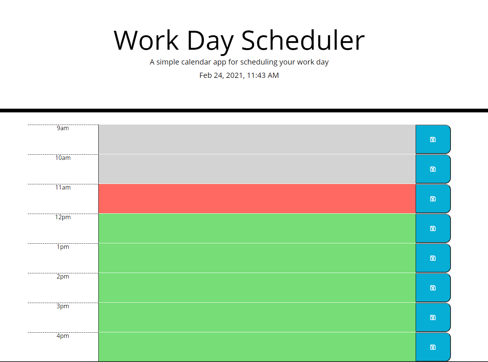

# Work-Day-Scheduler

This application allows user to add tasks to a dynamically changing Work Day Scheduler based on current time, that can be saved to local storage.

The Deployed Application can be accessed at: [Work Day Scheduler](https://seppalaerin.github.io/Work-Day-Scheduler/index.html)

# Technologies Used:
-HTML
-CSS
-Bootstrap v5.0.0
-javaScript

